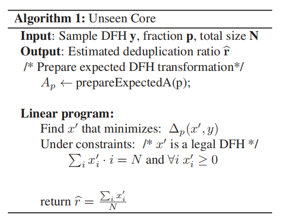

In this section we give a high level presentation of the core Unseen algorithm. The input of the algo- rithm is a DFH y of the observed sample $S_{p}$ and from it the algorithm finds an estimation $\hat{x}$ of the DFH of the entire dataset S. At a high level, the algorithm finds a DFH $\widehat{x}$ on the full set that serves as the "best explanation" to the observed DFH y on the sample.

算法的输入是  样本的DFH
算法根据 样本的DFH 评估得到整个数据集的DFH $\widehat{x}$

说人话：Unseen算法可根据样本的DFH估计出整个数据集的DFH

在图片中的文字是：
In this section we give a high level presentation of the core Unseen algorithm. The input of the algorithm is a DFH $y$ of the observed sample $\mathcal{S}_p$ and from it the algorithm finds an estimation $\hat{x}$ of the DFH of the entire dataset $\mathcal{S}$. At a high level, the algorithm finds a DFH $\hat{x}$ on the full set that serves as the "best explanation" to the observed DFH y on the sample.
As a preliminary step, for a DFH $x'$ on the dataset $\mathcal{S}$ define the expected DFH $y'$ on a random p sam-ple of $\mathcal{S}$. In the expected DFH each entry is ex-actly the statistical expectancy of this value in a ran-dom p sample. Namely $y_i^{\prime }$ is the expected number of chunks that appear exactly i times in a random p fraction sample. For fixed p this expected DFH can be computed given $x'$ via a linear transforma-tion and can be presented by a matrix $A_p$ such that $y'= A_p \cdot x'$.  
The main idea in the Unseen algorithm is to find an $x'$ that minimizes a distance measure between the expected DFH $y'$ and the observed DFH y. The distance measure used is a normalized L1 Norm (normalized by the values of the observed y). We use the following notation for the exact measure being used: 
$\Delta _p(x',y)=\sum_{i}\frac{1}{\sqrt{y_i+1}}|y_i-(A_p \cdot x')_i |$.

这个公式是某种误差度量或损失函数的表达式
- **$\Delta _p(x',y)$**：这是整个表达式的主体，表示在点 $x'$ 和真实值 $y$ 之间的第 $p$ 个误差度量。这里的 $p$ 是表示取样率为$p$
- **$\sum_{i}$**：这是一个求和符号，表示对某个指标 $i$ 的所有可能值进行求和。这里的 $i$ 可能遍历向量 $y$ 和 $x'$ 的所有元素。
- **$\frac{1}{\sqrt{y_i+1}}$**：这是每一项的权重因子，它依赖于 $y_i$ 的值。这个权重因子随着 $y_i$ 的增加而减小，这意味着较大的 $y_i$ 值在误差计算中的权重会较小。分母中的 $+1$ 是为了避免在 $y_i = 0$ 时出现除以零的情况。
- **$|y_i-(A_p \cdot x')_i |$**：这是误差项，表示真实值 $y_i$ 与预测值 $(A_p \cdot x')_i$ 之间的绝对差值。这里的绝对值确保了误差总是非负的。
  - **$y_i$**：这是真实值向量 $y$ 的第 $i$ 个元素。
  
  - **$(A_p \cdot x')_i$**：这是预测值向量，它是通过将参数矩阵 $A_p$ 与预测向量 $x'$ 进行点积（或矩阵乘法）操作得到的第 $i$ 个元素。这里的点积可能是指标准的矩阵乘法，也可能是某种特定的运算，具体取决于上下文。

将所有这些部分组合起来，这个公式计算的是在给定的参数 $p$ 下，预测向量 $x'$ 与真实向量 $y$ 之间的加权绝对误差的总和。权重是依赖于真实值 $y_i$ 的，并且通过平方根函数进行了调整。

由于权重因子的存在，这个度量对于较小的真实值 $y_i$ 会更加敏感。

<!-- Algorithm 1: Unseen Core   
Input: Sample DFH y, fraction p, total size N    
Output: Estimated deduplication ratio $\hat{r}$  
/* Prepare expected DFH transformation */  
$A_{p} \leftarrow $ prepareExpectedA(p);  
Linear program:  
Find $x^{\prime}$ that minimizes: $\Delta_{p}\left(x^{\prime},y\right)$  
Under constraints: /* $x^{\prime}$ is a legal DFH */  
$\sum_{i} x_{i}^{\prime}: i=N$ and $\forall_{i} x_{i}^{\prime} \geq 0$
return $\widehat{r}= \frac{\sum_{i} x_{i}^{\prime}}{N}$ -->

